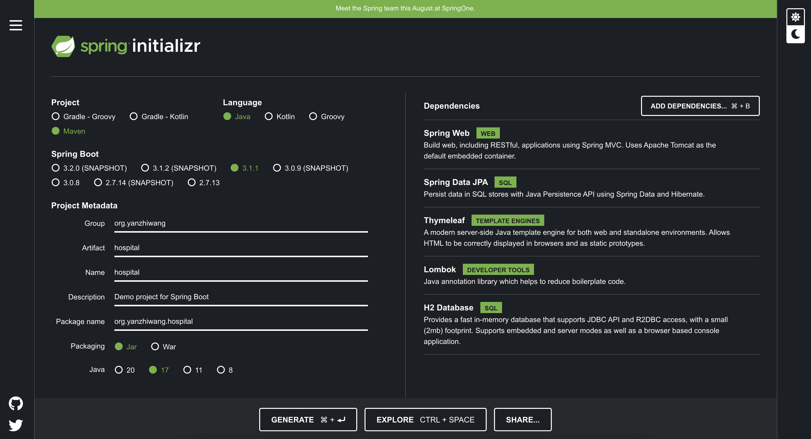
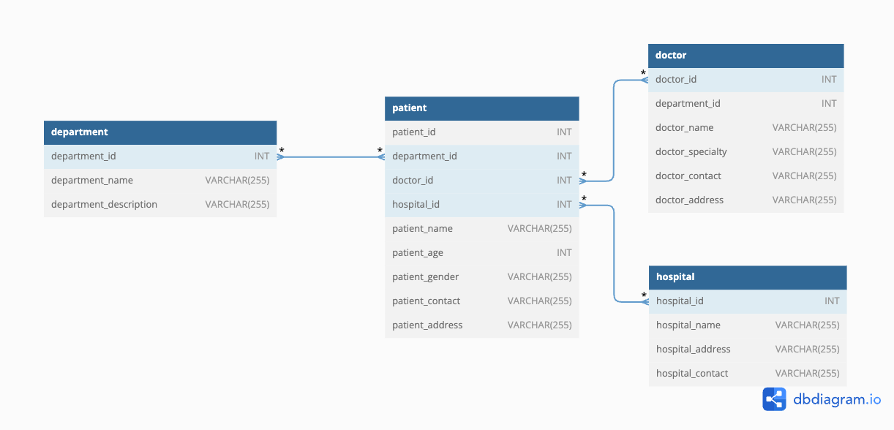

## Hospital Management System 
- The hospital management system is a spring boot-based application designed to streamline the management of patient information in healthcare facilities. It serves as a centralized database that enables healthcare providers to register, organize, and keep track of patient records, ensuring efficient and accurate patient management throughout the healthcare journey 
## Technical Specifications 
- Spring Boot Dependency 
 -  
- Model 
    - Department 
    - Patient 
    - Doctor 
    - Hospital 
- Relationship 
    - A department is associated with multiple patient and a patient is associated with multiple department 
    - A doctor can treat multiple patients, and a patient can consult multiple doctors 
    - A patient can be admitted to multiple hospitals, and a hospital can accommodate multiple patients 
    - 
    - [dbdiagram](https://dbdiagram.io/d/64b0ac9102bd1c4a5e0db4d9)

